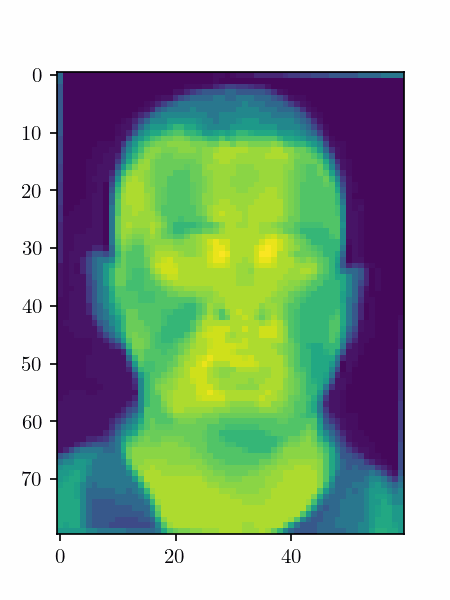

# Smoothrandaugment

The `Smoothrandaugment` algorithm provides a novel approach on video augmentations. The fundamental concept is analogous to the [RandAugment](https://arxiv.org/abs/1909.13719) augmentation, yet this novel methodology employs dynamic augmentations that evolve over time. The benefits of using dynamic augmentations on video data have already been demonstrated in [[1]](#1).

The augmentations used by `Smoothrandaugment` were mainly designed for thermal video and used to improve the robustness of the model developed in [[2]](#2) for the [HIRA](https://www.hira-project.com) project.

Before using the smooth augmentations, a visual inspection of the augmented video is raccomended, in order to fine-tune the bounds for a specific task.

## Smooth augmentations
There are two type of developed augmentations:
- geometric based
- color based

The common paramters are:
- `aug_p` (float, optional): Agumentation probability. Defaults to 1.0.
- `n_frmaes` (int, optional): Number of frames of the videos. Defaults to 150.
- `min_bound` (float, optional): Minimum angle in degrees for the augmentation. Defaults to -30.0.
- `max_bound` (float, optional): Maximum angle in degrees the augmentation. Defaults to 30.0.
- `linear` (bool, optional): Whether to use linear factors (`True`) or generated from sine waves (`False`). Defaults to `True`.
- `n_signals` (int, optional): Number of sinusoidal signals to be used when using non linear technique (`linear=False`). Defaults to 50.
- `weighted_wave` (bool, optional): Whether to use a random weight that divides the generated factors of the sinusoidal technique. Defaults to `False`.

The input is a video of shape $$[\mathrm{batch\textunderscore size} \times \mathrm{frames} \times \mathrm{channels} \times \mathrm{height} \times \mathrm{width}]$$. Note that $$\mathrm{batch\textunderscore size}$$ must be equal to 1.

### Smooth Geometric augmentations
There are 4 kind of smooth geometric augmentations:
- Rotation
- Zoom
- Translation on X and Y
- Shear on X and Y

All these augmentations have a `multi_augs` boolean parameter that must be set to `True` when two or more augmentations are used, for example in the [Compose](https://pytorch.org/vision/main/generated/torchvision.transforms.Compose.html) fuction.

### Smooth Color augmentations
There are 2 color intesity based augmentations:
- Brightness
- Contrast

The aforementioned augmentations merely alter the color intensity of the video frames in a dynamic manner.

### Smoothrandaugment
The algorithm incorporated alle the other agumentations.
The parameters are:
- `num_ops` (int, optional): Number of augmentations to be randomly selected and applied. Defaults to 2.
- `aug_p` (float, optional): Augmentation probability for each augmentation. Defaults to 1.0.
- `linear` (bool, optional): Whether to use linear factors (`True`) or generated from sine waves (`False`). Defaults to `True`.
- `weighted_wave` (bool, optional): Whether to use a random weight that divides the generated factors of the sinusoidal technique. Defaults to `False`.

## Example
This is an example of `Smoothrandaugment` applied to a video with a [Charlotte thermal face](https://github.com/TeCSAR-UNCC/UNCC-ThermalFace) used as background. In particular, smooth rotation and brightness were applied.

## References
<a id=1>[1]</a>
Taeoh Kim et al. Exploring temporally dynamic data augmentation for video recognition, 2022.

<a id=2>[2]</a>
Federica Gioia, Filippo Pura, Marco Forgione, Dario Piga, Alberto Greco, and Arcangelo Merla. Respiratory frequency reconstruction from thermal video signals: an end- to-end deep learning approach. In preparation, 2024.
